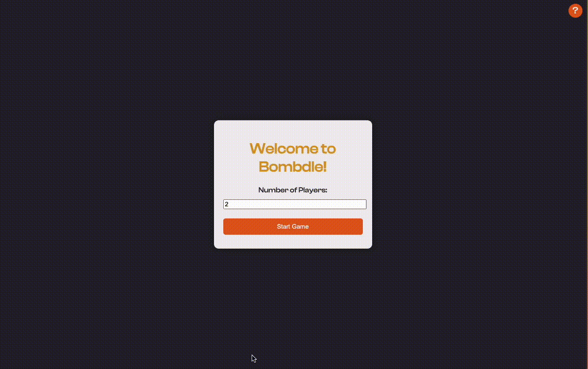

Welcome to **Bombdle**, a fun and challenging word game where players take turns finding words containing a given pair of letters. The last player standing wins!


## What is the game about?

Bombdle is a multiplayer word game where players compete to find words containing a specific pair of letters. Each player has a limited amount of time to submit a valid word. If a player fails to find a word in time, they lose a life. The game continues until only one player remains, who is declared the winner.

## Gameplay



## How to setup the game to play it

Follow these steps to set up and play Bombdle:

1. **Clone the repository:**
    ```bash
    git clone https://github.com/xvvcs/bombdle.git
    cd bombdle
    ```

2. **Open the project in your preferred code editor (e.g., Visual Studio Code).**

3. **Install the necessary libraries:**
    - No external libraries are required for this project.

4. **Open [index.html](http://_vscodecontentref_/0) in your web browser to start the game.
   You can use bash command:**
   ```bash
   open index.html
   ```

## Libraries needed

Bombdle is built using vanilla JavaScript, HTML, and CSS. No additional libraries are required to run the game.

## How to play

1. **Choose the number of players (2-6).**
2. **Enter unique nicknames for each player.**
3. **Take turns to find words containing the given pair of letters.**
4. **If a player fails to find a word in time, they lose a life.**
5. **The last player standing wins the game!**

## Contributing

We welcome contributions to improve Bombdle! If you have any ideas, suggestions, or bug reports, please open an issue or submit a pull request.

## License

This project is licensed under the MIT License. See the LICENSE file for details.

---

Enjoy playing Bombdle! 🎉
